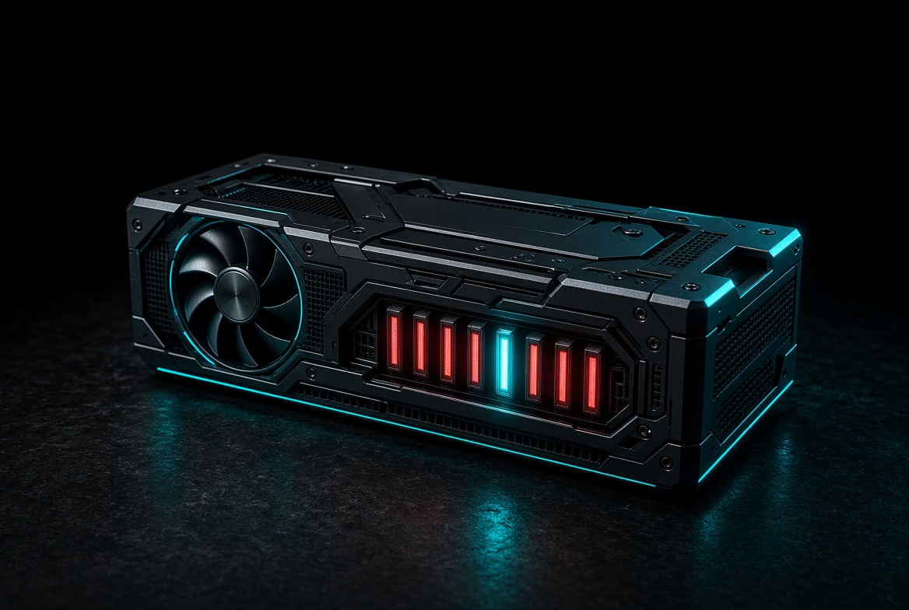
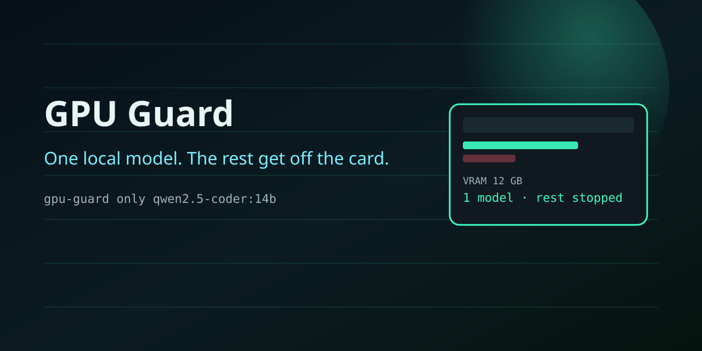
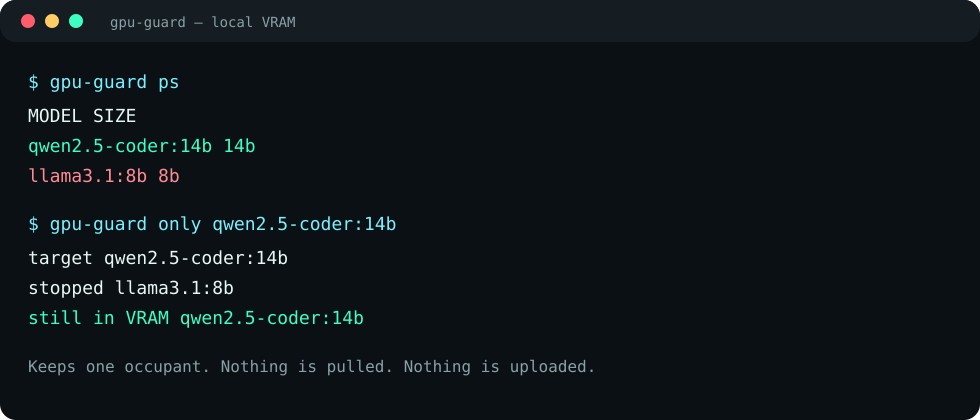

# GPU Guard

One local LLM in VRAM. Everything else gets unloaded.

[](LICENSE)
[](https://www.python.org/downloads/)
[](https://github.com/ironeye11-bot/gpu-guard/actions/workflows/ci.yml)

<p align="center">
  
</p>
<p align="center">
  
</p>

**12 GB cards choke when two models sit in VRAM.**  
GPU Guard talks to the Ollama CLI and unloads everything except the one model you want. It does not pull weights. It does not start a server. It does not send telemetry.

<p align="center">
  
</p>

## Install

```bash
pip install git+https://github.com/ironeye11-bot/gpu-guard.git
```

Needs `ollama` on `PATH`. Override the binary with `OLLAMA_BINARY` if you have to.

## Use

```bash
gpu-guard ps
gpu-guard only qwen2.5-coder:14b
gpu-guard stop llama3.1:8b
gpu-guard stop-all
gpu-guard only qwen2.5-coder:14b --json
gpu-guard --json ps
```

`only` **never loads** the target. If it is not already resident, the other models are still stopped and VRAM is free for *you* to load it.

## Library

```python
from gpu_guard import ensure_only, loaded_models

print(loaded_models())
ensure_only("qwen2.5-coder:14b")
```

## Why this exists

Local coding agents stack a 14B and an 8B “just in case”. On a 3060 / 4060 / 4070 laptop that often means a hung session, not a feature. One command, one occupant.

## Tests

```bash
python3 -m unittest discover -s tests -v
```

## License

MIT
